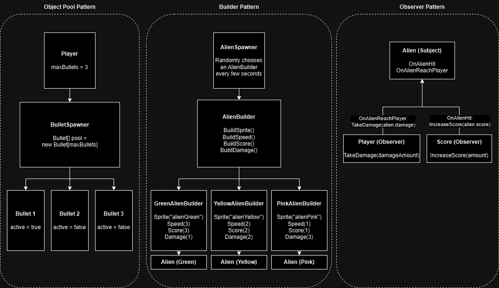

# Lab9

Design Patterns Implementation:

- **Object Pool Pattern**: Implemented an object pool of bullets fired by the player using an array. All possible bullets are created and set to "inactive" at the beginning of the game. "Active" bullets are stored at the beginning of the array and "Inactive" bullets are stored at the end of the array. Whenever the player fires a bullet, it "activates" a bullet from the object pool, which becomes "deactivated" whenever it hits an alien or flies out of the screen.
- **Builder Pattern**: Aliens have different attributes (sprite, speed, score, & damage) which are constructed using the builder pattern. The abstract class, AlienBuilder, defines the methods each alien type must implement to create a specific type of alien. The concrete subclasses of AlienBuilder are GreenAlienBuilder, YellowAlienBuilder, and PinkAlienBuilder, and the AlienSpawner randomly chooses one of those to build and spawn the different alien types.
- **Observer Pattern**: The alien class exposes two events, OnAlienHit and OnAlienReachPlayer, for observers to observe. The Score object observes OnAlienHit, and whenever an alien is hit, the score goes up. The player object observes OnAlienReachPlayer, and whenever an alien reaches the player, the player's health goes down.